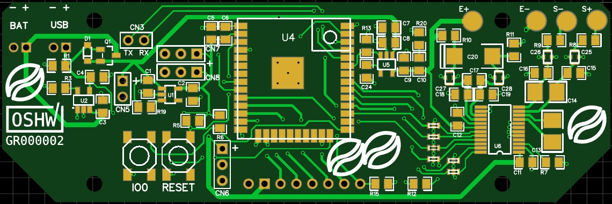
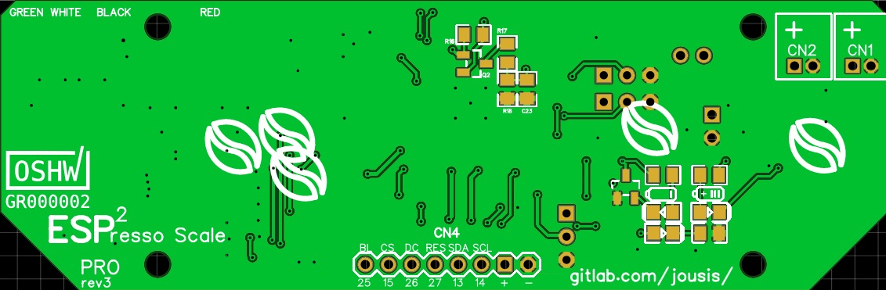
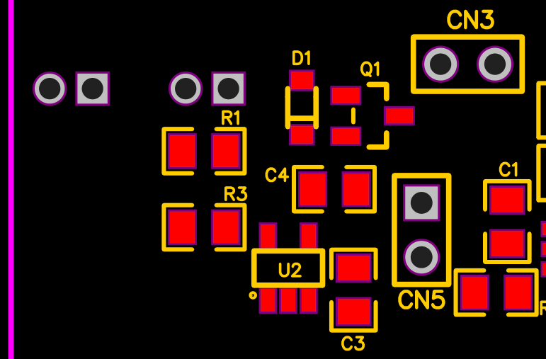
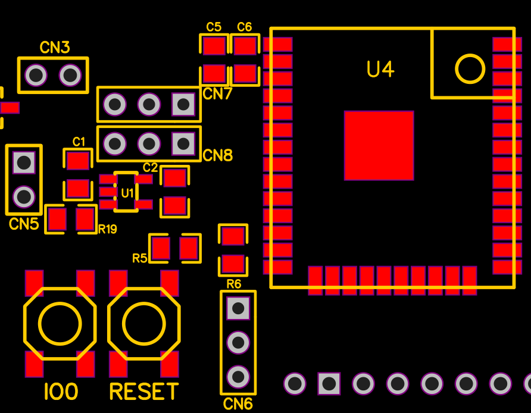
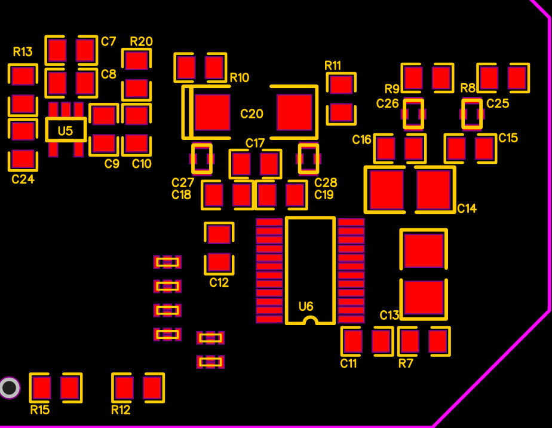
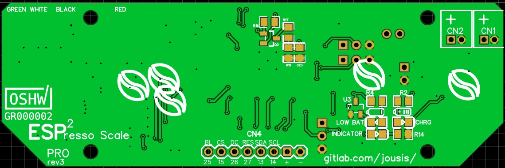
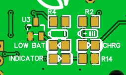

**ESP^2^resso Scale PRO**

**PCB Assembly Guide (v3)**

**WIP**

{width="7.270833333333333in"
height="2.4270833333333335in"}

{width="7.260416666666667in"
height="2.3854166666666665in"}

With a little care, you can easily hand solder all the components. No
need for hot air.

If you want to minimize the cost, all components except the ADC can be
replaced with cheaper alternatives. Try to avoid very cheap components
in the analog section (RC filtering) or you might lose some
accuracy/stability.

Why "espresso" scale?\
High resolution, high refresh rate needed during an espresso extraction.
Apart from that, it is a normal scale.

Why "PRO"?

You can use any SPI (or I2C) screen (even TFT with backlight pin),
slightly better RC filtering, speed/gain control of the ADC from the
software, better separation of analog/digital tracks, power on/off of
the second LDO.

**Section 1 -- USB / Battery Input & charging**

{width="4.270833333333333in"
height="2.808320209973753in"}

[Battery charging circuit design: Sparkfun ESP32
Thing](https://cdn.sparkfun.com/assets/learn_tutorials/5/0/7/esp32-thing-schematic.pdf)

If you don't care about battery / battery charging you can connect DC+5V
to CN5 and do not solder any of the parts shown above.

Please see the schematics for more info.

**Section 2 -- LDO & MCU**

{width="4.489583333333333in"
height="3.493089457567804in"}

**LDO (U1)**

You can use any LDO pin-compatible with TLV75533PDBVR (SOT-23-5). You
don't need one with enable pin but if it has one, check its datasheet
and:

-   If it needs logic high for enable, solder R19 (100K). R19 goes to
    vin (C1).

-   If it needs logic low solder a jumper cable from R19 right pad to
    GND of CN5.

CN5 is optional header, you can use it to give power to the LDO without
having to connect the Section 1 part. Very handy for testing.

**MCU (U4)**

You can use any esp32 wroom with the same footprint (ESP32, ESP32D,
ESP32U).\
Why module (wroom) and not barebones chip?\
Easier to solder, readily available, reasonable size.

**Programming**

The only way to program your MCU for the 1^st^ time is through the
serial connector on the bottom. There is no ftdi chip on the PCB.
Afterwards, if you wish, you can setup an OTA method.

**Touch Input**

The middle pin of the three connectors CN6,CN7,CN8 goes to a touch pin
of esp32 (T5,T8,T9). You can use them with internal capacitive methods
if you prefer. Or...

**Regular buttons/ External digital IO touch modules**

CN6,CN7,CN8 provide an easy way to connect regular buttons using
internal PULLUP/PULLDOWN or any external touch module with digital
output. All three provide VCC(3.3V) / IO / GND.

**Section 3 -- ADC / Load Cell**

{width="4.989583333333333in"
height="3.866379046369204in"}

**Analog Voltage LDO**

U5 is the local LDO for the excitation voltage of the load cell (and
reference voltage). Use high quality components on everything related to
the analog circuit.

**R20**

Is there to add some resistance to C10 if you want to use MLCC and your
LDO works better with some ESR (most). If you don't want to use any R
there (not even 0R?), solder bridge both pads.\
**Warning: C20 is not grounded. It goes to ground through R20.**

**C24**

Completely optional. Only if your LDO had a need/option for Cnr
capacitor to reduce its output noise. Check datasheet for correct value.

**Comments on the analog LDO**

You don't have to use any of them but since this is a very crucial part
of the scale, I like to share my thoughts and experiments.

Disclaimer: I know there is a pattern in my project with a special brand
(TI) but I am not in any way affiliated to them, everything was paid
using my own money. I cannot deny though that I really like the quality
and specs of their components.

**Option 1 -- OK for battery use (BOM)**

TPS7A0533PDBVR

200mA **3.3V** with 210mV dropout and **1uA Iq while working (0.1A on
shutdown)**. Good all around. You can use this LDO only with 5V input
(max Input 5.5V). Place 0R on R20 or solder bridge the pads, leave C24
unpopulated.

I used this LDO with most of my tests, works well but it is nothing
extraordinary. If your main use is battery, excitation voltage cannot go
above 3.3V (maybe slightly) so 3.3V regulator is all we need.

**Option 2 -- OK for battery use**

TLV75533PDBVR

500mA **3.3V** with 210mV dropout and **25uA Iq while working (0.1A on
shutdown)**. Good all around. You can use this LDO only with 5V input
(max Input 5.5V). Place 0R on R20 or solder bridge the pads, leave C24
unpopulated.

I used this LDO with most of my tests, works well but it is nothing
extraordinary. If your main use is battery, excitation voltage cannot go
above 3.3V (maybe slightly) so 3.3V regulator is all we need.

[Note: you can use this LDO for both analog and digital, reducing the
parts you will need to buy.]{.ul}

**Option 3 -- OK for mixed use (DC / Battery)**

TPS76950DBVR

100mA **5V** with 70mV dropout, **17uA while working (1uA on
shutdown)**. Its max input V is 10V so if you provide 7V+ input you will
have 5V excitation voltage for our load cell. The same LDO will work
fine on battery but if you don't intend to provide DC input on the
scale, prefer the TPS7A for its low Iq. Place 0R on R20 or solder bridge
the pads, leave C24 unpopulated.

Advantages:

-   Up to 5V excitation voltage (with 10V\>Vin\>7V) for increased
    accuracy

-   Very low dropout voltage

Disadvantages:

-   Works fine on battery due to its relatively low Iq but not as well
    as option1

**Option 4 -- Low noise -- mixed use**

TPS73643DBVR (4.3V) or TPS73633DBVR (3.3V)

400mA with 75mV dropout and **500uA** **ground current while working,
0.02uA on shutdown**. With C24 (0.01uF) this LDO has very low noise on
output. The drawback is its very high ground current while working. For
short periods on, large periods off (espresso), it is a viable option.
Also note its impressive shutdown current (0.02uA). TPS73643DBVR is the
optimal solution here for mixed use (battery/5V DC). You will get 4.3V
excitation voltage while on DC for increased accuracy. Place 0R on R20
or solder bridge the pads.

Warning: check firmware options, this LDO needs LOW for enable and HIGH
for disable.

Advantages:

-   Up to 4.3V excitation voltage (max Vin 5.5V)

-   Very low noise if you populate C24 (0.01uF)

-   Very low shutdown current

-   Very low dropout voltage

-   3.3V can be used as a main LDO as well, reducing the parts you need
    to buy (not recommended)

Disadvantages:

-   Very high ground current while working.\
    Not recommended for prolonged use while on battery. Decrease
    light/deep sleep timeout on firmware (those two options shut down
    the ADC LDO).\
    Not recommended for use as main LDO (0.5mA consumption is a lot)

-   Very expensive, low availability

**Option 5 -- DC input only (\<16V)**

LP2985-50DBVR (5V) -- not tested yet

150mA with 280mV dropout and 850uA **ground current (0.01uA on
shutdown).** Since we don't mind about dropout and ground current, this
LDO is a good option because of its low noise and stable operation with
MLCC. Place 0R on R20 and 0.01uF capacitor on C24.

Warning: proposed main LDO cannot accept \>5.5V. You will need to change
it as well (see SPX3819M5-L-3-3)

Advantages:

-   Up to 5V excitation voltage for increased accuracy

-   Wide DC input voltage (\<16V)

-   Very low noise if you populate C24 (0.01uF)

-   Very low shutdown current

-   Good price (especially in quantity), good availability.

Disadvantages:

-   Very high ground current while working

**ADC**

Compared to the HX711 used in almost all the cheap (and not) designs,
ADS1232 from TI is very accurate and stable. Although much more
expensive, for this type of scale it is an expense you will have to
make. Even when heating it up it could manage 0.1g accuracy (has
internal temp sensor). Kudos to TI for their awesome documentation and
white papers. (notice: This project is in no way affiliated with TI)

Digital +3.3V comes from the main LDO, analog +3.3V from the local LDO.
There is only one ground for both signals (analog/digital) but I tried
to avoid any digital signal return path through the analog part of the
ADC. Unfortunately, due to the size constraints and the large number of
tracks needed for the LED segment controller, digital and analog tracks
are relatively close together. That said, I tested the same design with
separate analog ground (join under the ADC) and couldn't find measurable
difference.

**Notice: ADS1232 does not communicate using standard SPI. Please see my
(or any other) library.**

**RC filtering**

Finally, I settled with the reference design and parts. The only
exception is that I replaced the small 100pF PPS (ECH-U1C101GX5) with
NP0 (GRM2165C1H101FA01D) caps to lower the cost a little.

**Why those tiny feed throughs?**

I cannot measure/see any difference with/without them, but TI knows best
(they have them on the reference design). Run a jumper cable across if
you don't have them or even edit the pcb and remove them completely (if
you can't ask me -- I can make a new revision).

**Bottom Layer**

{width="7.268055555555556in"
height="2.43125in"}

Battery warning (works also while on deep sleep) & LEDs

{width="2.6458333333333335in"
height="1.5729166666666667in"}

U3 is a simple voltage supervisor circuit that will light LED2 (LOW BAT)
when LDO output is \<2.99 volts. Use a low power LED because it might
stay on for some time. Our MCU will die around 2.8V.

CHRG LED (LED1) is enabled when ...you guessed it... battery is
charging.

INDICATOR (LED3) is connected to mcu IO and you can use it in any way
you like.

All leds are placed closely together so you can design a small "window"
on your case. For the same reason, there are no indicators/names on the
final pcb (silkscreen) apart from the two battery icons.

{width="3.0104166666666665in"
height="1.0416666666666667in"}

CN4 is for OLED/TFT screens and I have labeled the pins for your
convenience.\
As is, you can connect the usual Chinese OLED modules (be careful of
VCC/GND pins) and some TFT modules.

**PINS**

From left to right as you see on the picture above:

1.  **Screen Backlight control (TFT) -- IO25 -- solder pulldown resistor
    R15 if you have a TFT**

2.  **CS -- IO15 (HSPI SS)**

3.  **DC -- IO26**

4.  **RES -- IO27**

5.  **SDA -- IO13 (HSPI MOSI)**

6.  **SCL -- IO14 (HSPI SCK)**

7.  VCC

8.  GND

Note: You must solder the R15 pulldown resistor next to the PWM pin if
you want to shut down the backlight.

Tip:

In order to mount your display as close to the PCB as possible without
soldering it directly to it, use 90 degree headers in a "Z"
configuration.
