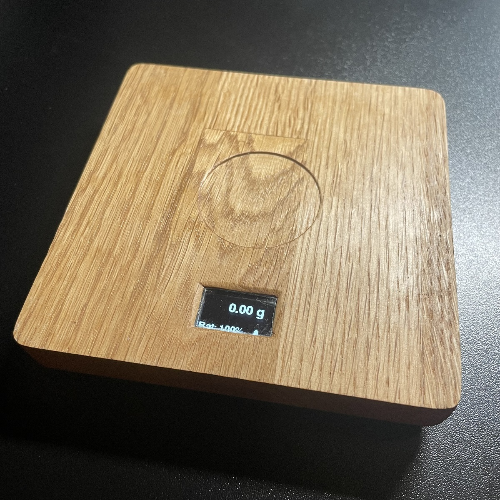
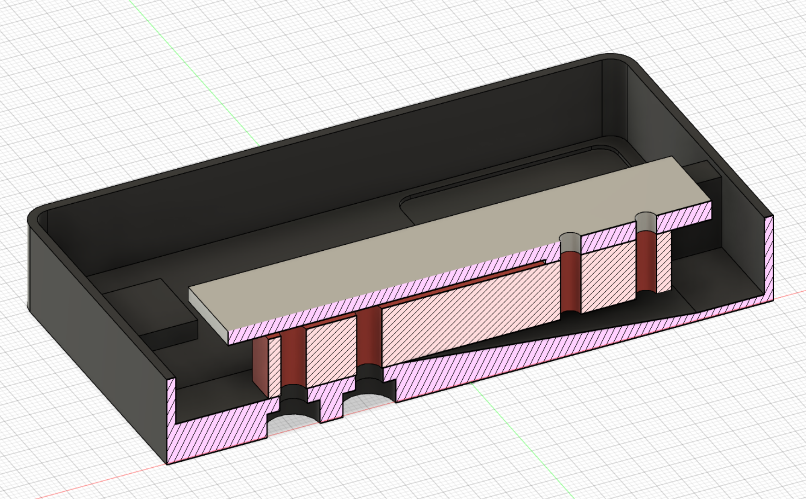

 **ESPresso Scale**  
Fully open source (s/w & h/w) scale project.
  
  
**Fork of the great project of jousis9** [https://github.com/jousis9/ESPresso-Scale]  
Main work is done by him! Thanks

  
  


**Features**
- Open source firmware, software and hardware
- ESP32 (wroom module) MCU
- ADS1232 24-bit ADC from TI
- Lipo and USB powered (I connected a wireless charging pad)
- 10SPS and 80SPS sampling speed with various options regarding filtering/smoothing
- Auto calibration function (selectable weight)
- Touch buttons , using ESP32 pins or external touch module (TTP223).
- 3d printed case (fusion360 files provided)
- Auto power off and consumes no power when "sleep" to extend battery life
- enable WiFi on demand (press both buttons during startup ) -> ```credentials.h```
- OTA support (if WiFi enabled) -> ```http://SCALEIP/update```
- UDP Logging (if WiFi enabled) to ```UDP_SERVER_IP```


**What is provided ?**
- [PCB assembly guide](./Hardware/Documents)
- [Schematics (PDF)](./Hardware/Schematics)
- [PCB easyEDA project export](./Hardware/easyEDA)
- [Fusion 360 project file for the cases](./Hardware/case)
- [Bill of materials (BOM)](./Hardware/Documents)
- [Firmware (Platform.io IDE project)](./Software/Firmware)


  

**Documentation**  
*UDP LOGGING Bash*  
Command for UDP Logging  
```bash
nc -u -l -p 44444
```  

  
**Load Cell - Work in Progress**  
*Due to the issue (down) i try a new load cell - WIP*
[Mavin NA1](https://www.mavin.cn/na1-oiml-c3-approved-load-cell-high-accuracy-single-point-sensor_p15.html) and 
[Mavin MV-NA27-2KG](https://www.mavin.cn/kitchen-scale-load-cell-low-capacity-weight-sensor-na27_p28.html)


**known Pitfall**  
[Repeatability](https://github.com/jousis9/ESPresso-Scale/issues/2#issue-1459375448)  
To avoid it I used an aluminum beam as a carrier and glued the top part of the case on the beam  
<p>



**Consider contributing**  

  
**License**  
<!--    -->
Software under [GPL v3](https://gitlab.com/jousis/espresso-scale/blob/master/LICENSE)  
Hardware under [CERN Open Hardware Licence v1.2](https://gitlab.com/jousis/espresso-scale/blob/master/hw-LICENSE)  
Documentation under [CC BY-SA license 2.0](https://creativecommons.org/licenses/by-sa/2.0/)
